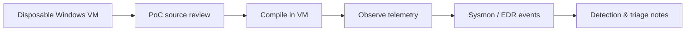

# Windows Process Injection Research Lab

A compact Windows research project for studying **classic remote-thread process injection** from a defender and malware-analysis perspective.


> **Lab-only project.** Use this repository only in isolated systems you own or are explicitly authorized to test.

## Why this project exists

Process injection is a common technique in malware, red-team tooling, and post-exploitation frameworks. Understanding its observable Windows API sequence helps defenders recognize it during reverse engineering, EDR investigations, and behavioral analysis.

This repository intentionally keeps the implementation small so the relationship between code and telemetry remains easy to inspect.

## Technique at a glance

The proof of concept demonstrates the classic sequence:

1. obtain a handle to a target process;
2. allocate memory in the remote process;
3. copy a demonstration payload into that memory;
4. create a thread whose start address points to the remote allocation.

The relevant Windows APIs are:

- `OpenProcess`
- `VirtualAllocEx`
- `WriteProcessMemory`
- `CreateRemoteThread`

This behavior maps to **MITRE ATT&CK T1055 — Process Injection**.

## Repository layout

```text
.
├── injector.c                 # Original educational PoC
├── detections/
│   ├── README.md              # Defender telemetry and triage notes
│   └── sysmon_remote_thread.yml
├── .github/workflows/ci.yml   # Windows compile/static build check
├── SECURITY.md
├── LICENSE
└── README.md
```

## Defensive learning goals

Use the project to practice:

- recognizing the API chain associated with remote-thread injection;
- correlating process access, memory manipulation, and remote-thread telemetry;
- mapping observed behavior to ATT&CK;
- comparing source-level behavior with EDR/Sysmon evidence;
- writing detection hypotheses that are specific enough to investigate without assuming every remote thread is malicious.

## Suggested isolated lab

A safe analysis workflow is:



Recommended controls:

- use a disposable Windows VM or sandbox;
- keep the test target local to the VM;
- do not expose the lab to production networks;
- snapshot the VM before testing;
- collect telemetry with Sysmon, Windows Event Logs, or your EDR;
- treat the PoC as a behavior generator, not as an operational tool.

## Detection perspective

No single API call proves malicious activity. A stronger investigation signal comes from **correlation**.

Examples of useful questions:

- Did one process obtain high-privilege access to an unrelated process?
- Was a remote thread created shortly afterward?
- Is the source process unusual for the target process?
- Does the thread start address resolve to a loaded image or to private memory?
- Is the process relationship expected for the host and user session?

The `detections/` directory contains a starter Sysmon-oriented rule and triage notes.

## Build check

The GitHub Actions workflow performs a Windows compilation check with MSVC using warning level 4. It does **not** execute the proof of concept.

For local research, compile only inside your authorized Windows lab environment.

## Scope and limitations

This repository is intentionally narrow. It is **not** a complete injector framework and does not attempt to provide:

- persistence;
- privilege escalation;
- credential access;
- network command-and-control;
- evasion or bypass logic;
- stealth features;
- exploitation.

The goal is to make one well-known Windows behavior easy to study and detect.

## Responsible use

This repository is intended for:

- malware-analysis education;
- blue-team detection engineering;
- reverse-engineering practice;
- controlled EDR/Sysmon testing;
- authorized security research.

Do not use it against systems you do not own or lack explicit permission to test.

## License

Distributed under the MIT License. See [LICENSE](LICENSE).
