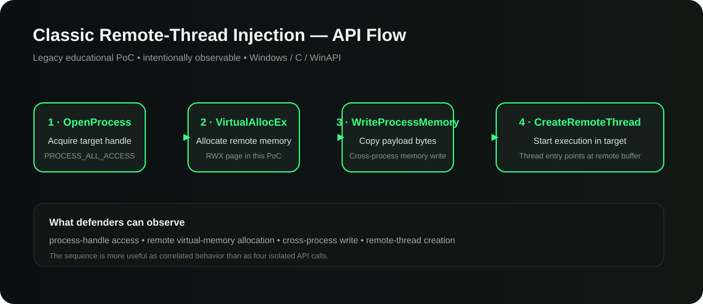
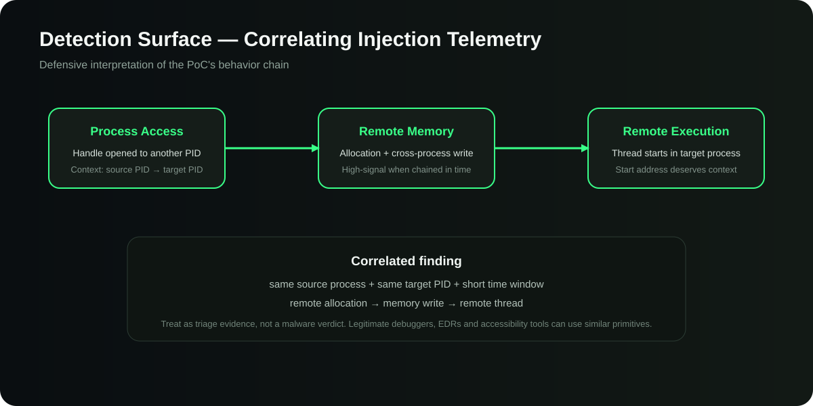

# Windows Process Injector — Legacy WinAPI Research PoC

<p align="center">
  
  
  
  
  
</p>

A compact **C / WinAPI process-injection proof of concept** kept as a technical reference for studying the Windows primitives behind classic remote-thread injection.

The value of this repository is not stealth or operational capability. It is the opposite: the implementation is deliberately small and observable so the complete behavioral chain can be inspected from a **malware-analysis, Windows-internals and detection-engineering** perspective.

> **Scope:** educational research and controlled lab use only. This repository is not presented as an EDR-evasion tool, production injector, red-team framework, persistence mechanism, or malware loader.

---

## Why this repository exists

Process injection is a useful technique to understand because it sits at the intersection of several disciplines:

- Windows process and virtual-memory internals;
- cross-process handle access;
- remote memory allocation and writes;
- thread creation across process boundaries;
- behavioral malware analysis;
- endpoint telemetry correlation;
- detection engineering around MITRE ATT&CK **T1055 — Process Injection**.

The source intentionally exposes the classic API sequence without abstraction. That makes the project useful as a small reference sample when studying how endpoint products can reason about **behavioral chains rather than isolated API calls**.

## Injection flow

<p align="center">
  
</p>

At a high level, the PoC performs four operations:

| Stage | WinAPI primitive | What happens |
| --- | --- | --- |
| 1 | `OpenProcess` | Opens a handle to the target PID. |
| 2 | `VirtualAllocEx` | Reserves and commits memory inside the target process. |
| 3 | `WriteProcessMemory` | Copies the embedded payload bytes into the remote allocation. |
| 4 | `CreateRemoteThread` | Creates a thread whose start address points to the remote buffer. |

This is the classic remote-thread injection pattern. The current sample uses `PROCESS_ALL_ACCESS` and an executable+writable remote page (`PAGE_EXECUTE_READWRITE`), making it intentionally straightforward and comparatively noisy from a defensive perspective.

## Source walkthrough

The repository is intentionally small: the implementation lives in `injector.c` and follows a linear control flow.

### 1. Target process access

The program receives a PID from the command line and asks Windows for a process handle.

```c
hProcess = OpenProcess(PROCESS_ALL_ACCESS, FALSE, PID);
```

From a defensive point of view, the important property is **cross-process access**. A single process opening another process is not automatically malicious; debuggers, endpoint agents and administrative tooling can do the same. Context matters.

### 2. Remote virtual-memory allocation

The program allocates memory in the target process with `VirtualAllocEx`.

```c
pRemoteBuffer = VirtualAllocEx(
    hProcess,
    NULL,
    sizeof(shellcode),
    MEM_RESERVE | MEM_COMMIT,
    PAGE_EXECUTE_READWRITE
);
```

For this legacy PoC the allocation is **RWX**. That choice keeps the mechanism obvious for study, but it is also an important reason this sample should be viewed as an educational artifact rather than a realistic attempt at stealth.

### 3. Cross-process memory write

`WriteProcessMemory` transfers the embedded byte array into the target's address space.

```c
WriteProcessMemory(
    hProcess,
    pRemoteBuffer,
    shellcode,
    sizeof(shellcode),
    NULL
);
```

The defensive signal is stronger when this operation is correlated with the preceding remote allocation and the same source/target process relationship.

### 4. Remote thread creation

Finally, the PoC calls `CreateRemoteThread` and uses the remote buffer as the thread entry point.

```c
CreateRemoteThread(
    hProcess,
    NULL,
    0,
    (LPTHREAD_START_ROUTINE)pRemoteBuffer,
    NULL,
    0,
    NULL
);
```

This completes the classic chain:

```text
source process
     │
     ├─ opens target process
     ├─ allocates target memory
     ├─ writes into target memory
     └─ creates target thread
              │
              ▼
       execution begins at
       the remote allocation
```

## Detection-engineering view

<p align="center">
  
</p>

The main lesson of the project is that **sequence and context matter more than a single API name**.

A useful behavioral model is:

```text
process A opens process B
        ↓
process A allocates memory in B
        ↓
process A writes bytes into B
        ↓
process A creates a thread in B
        ↓
correlate source PID + target PID + time window
```

Potential defensive evidence includes:

- one process obtaining sensitive access to another process;
- remote virtual-memory allocation;
- cross-process memory modification;
- a thread being created in another process;
- the new thread beginning in a dynamically allocated executable region;
- unusual parent/child or source/target relationships around the activity.

None of those observations alone should be treated as proof of malware. Legitimate software can use related primitives. Detection quality comes from **correlation, provenance and surrounding telemetry**.

## ATT&CK mapping

The behavior represented by this sample maps conceptually to:

**MITRE ATT&CK T1055 — Process Injection**

The mapping is used here as a detection-engineering reference, not as a claim that the sample implements every T1055 sub-technique. The repository demonstrates one classic remote-thread-style pattern built from documented Win32 APIs.

## Lab build

The program is a native Windows C source file. It can be compiled in a controlled Windows development environment with a standard C toolchain.

### MinGW

```bash
gcc injector.c -o injector.exe
```

### Visual Studio Developer Command Prompt

```text
cl injector.c
```

The sample expects a target PID as its command-line argument. Because the repository contains an executable payload and performs real cross-process memory modification, testing should be restricted to an **isolated lab VM and disposable test process** that you own and control.

## What this project intentionally does not try to be

This repository deliberately remains a small historical/educational PoC. It does **not** attempt to provide:

- stealth or EDR bypasses;
- AMSI/ETW tampering;
- persistence;
- privilege escalation;
- credential access;
- process discovery automation;
- target selection logic;
- payload generation;
- encrypted loaders;
- direct/indirect syscall frameworks;
- arbitrary remote control;
- exploit delivery.

Those omissions are intentional. The project is retained because the simple implementation makes the underlying Windows behavior easy to study.

## Known limitations

The current implementation is intentionally minimal and has several engineering limitations:

- it uses `PROCESS_ALL_ACCESS` rather than a narrowly scoped access mask;
- the remote page is `PAGE_EXECUTE_READWRITE`;
- the payload is embedded directly in the source;
- architecture compatibility is assumed rather than negotiated;
- error reporting is intentionally basic;
- cleanup is minimal on some failure paths;
- there is no test suite or CI because the project is preserved as a compact legacy sample rather than an actively expanded injector.

These limitations are documented instead of being "fixed" because modernizing them toward stealthier or more operational injection would work against the purpose of the repository.

## Relationship to the rest of the portfolio

This project is best understood alongside the defensive Windows projects in the same portfolio:

| Repository | Perspective |
| --- | --- |
| **[Windows-Process-Injector-C](https://github.com/Michel-DV/Windows-Process-Injector-C)** | Small legacy sample showing the behavior that defenders need to understand. |
| **[ProcSentinel-C](https://github.com/Michel-DV/ProcSentinel-C)** | Read-only Windows endpoint and PE triage. |
| **[Win-TraceGuard](https://github.com/Michel-DV/Win-TraceGuard)** | ETW telemetry, behavioral detection and event correlation. |

Together they show the progression from **understanding a low-level primitive** to **observing and reasoning about endpoint behavior defensively**.

## Responsible use

Use this repository only on systems and processes you own or are explicitly authorized to test. Do not use the sample against third-party systems, production endpoints or environments where you do not have permission to perform process-memory manipulation.

The repository is maintained as a cybersecurity education and defensive-research artifact.

---

<p align="center">
  <sub><code>MDV // understand the primitive, then learn how to detect the behavior.</code></sub>
</p>
